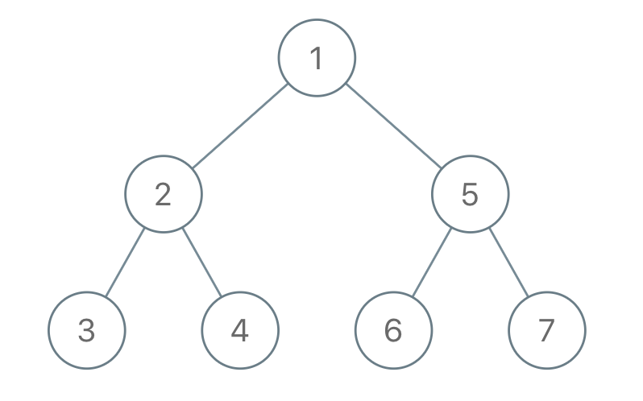

#### 1028. 从先序遍历还原二叉树

我们从二叉树的根节点 `root` 开始进行深度优先搜索。

在遍历中的每个节点处，我们输出 `D` 条短划线（其中 `D` 是该节点的深度），然后输出该节点的值。（如果节点的深度为 `D`，则其直接子节点的深度为 `D + 1`。根节点的深度为 `0`）。

如果节点只有一个子节点，那么保证该子节点为左子节点。

给出遍历输出 `S`，还原树并返回其根节点 `root`。

**示例 1：**



```
输入："1-2--3--4-5--6--7"
输出：[1,2,5,3,4,6,7]
```

**示例 2：**


```
输入："1-2--3---4-5--6---7"
输出：[1,2,5,3,null,6,null,4,null,7]
```

**示例 3：**


```
输入："1-401--349---90--88"
输出：[1,401,null,349,88,90]
```

**提示：**

- 原始树中的节点数介于 `1` 和 `1000` 之间。
- 每个节点的值介于 `1` 和 `10 ^ 9` 之间。